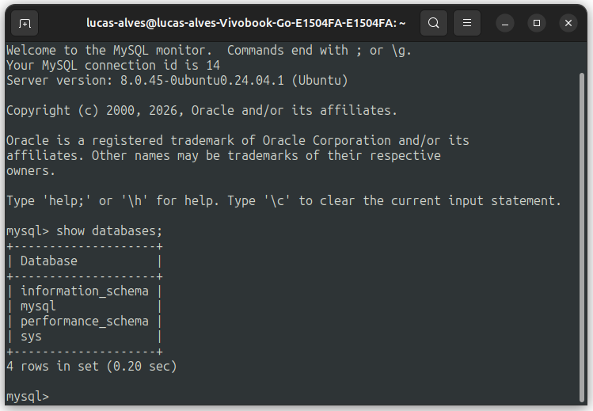
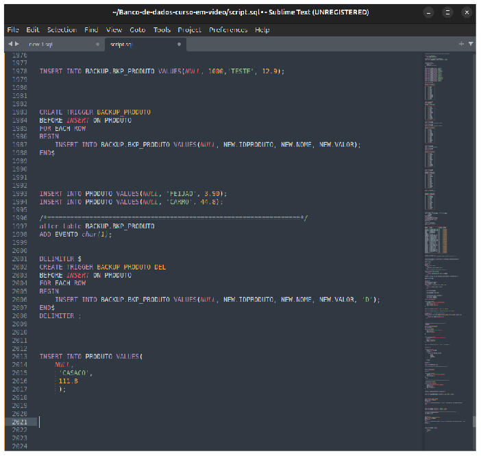

# Banco de dados -  Nível júnior à Pleno  


  

# Introdução  
<p style="text-align: justify; width: 800px; text-indent:20px">
    Seguir este material já pressupõe que você pesquisou sobre a história do surgimento do banco de dados, o que ele resolve etc... 
    Aventure-se à estudar os fundamentos dos bancos de dados, como conceitos essenciais de estruturação, armazenamento e recuperçaõi de dados 
    até aspectos que podem te fornecer insights valiosos sobre relevãcia e benefícios práticos dos bancos de dados na organização.
</p>
<p style="text-align: justify; width: 800px; text-indent:20px">
        Deixo um link no final desta introdução, uma pagina da Alura fornecendo informações valiosas sobre o que precisa saber sobre bancos de dados, não avance
        sem antes de ler minha sugestão. <br>        
</p>

[](https://www.alura.com.br/artigos/banco-de-dados?srsltid=AfmBOop28cObhvT4EdIBA9g_ZtqymTAc57JXGSfFpp2H-DpospysFmGB)


# O que um Júnior precisa saber em MYSQL (Na prática) 
### 🟢 Nível 1 - Essencial(Sem isso você não passa nem no primeiro filtro)  

### Comandos básicos de cor  
`SELECT`, `INSERT`, `UPDATE`, `DELETE`  
`WHERE`, `ORDER BY`, `LIMIT`, `OFFSET`  
`INNER JOIN`, `LEFT JOIN (RIGHT JOIN é raro)`  
`GROUP BY + funções de agregação (COUNT, SUM, AVG, MAX, MIN)`  
`HAVING (filtro após GROUP BY)`  
`DISTINCT` 
### Criar e alterar tabelas  
```python
# 1ª - Criando o banco de dados
CREATE DATABASE loja;
# 2º Selecionar o banco de dados.
USE loja; 
# Criando uma tabela chamada "usuário"
CREATE TABLE usuario(
    id INT PRIMARY KEY AUTO_INCREMENT,                 # auto incremento de indice para cada registro
    nome varchar(30) NOT NULL,                         # not null significa que este campo é obrigatório a preenchimento do dado
    email varcahr(30) UNIQUE NOT NULL,                 # além de ser obrigatório, ele é unico e o sisitema acusará dado repetido.
    criado_em TIMESTAMP DEAFULT CURRENT_TIMESTAMP      # registra a data e hora em que foi colocado os dados no sisitema
);  
# inserir dados
INSERT INTO usuario(NOME, EMAIL)VALUES('Lucas Alves', 'lucaslorencoalves.me@gmail.com'); # os campos que são automaticamente inseridos dado pelo próprio banco, não precisa inserir manualmente.

# Veja o que tem na tabela
SELECT * FROM usuario;

#Veja a estrutura da tabela - tipos dos dados - As constraints(regras de cada registro, se é NOT NULL, UNIQUE NOT NULL etc...)
DESC usuario

# Adiciona algumas colunas do tipo INT, FLOAT(decimal), TIMESTAMP - inclua tanto no inicio, meio e fim.
ALTER TABLE usuario ADD COLLUMN telefone VARCHAR(20);   # se não especificar o lugar da coluna, o sistema coloca sempre no final da tabela
ALTER TABLE usuario ADD COLUMN  salario DECIMAL(10, 2); # O salário tem 10 digitos com 2 casa após a vírgula
ALTER TABLE usuario ADD COLLUMN cpf varchar(12) FIRST;  # Coloca a coluna cpf no inicio - para colocar em qualquer lugar da tabela basta colocar sempore APÒS de uma coluna usando "AFTER";
ALTER TABLE usuario ADD COLUMN  rua varchar(50) AFTER cpf; #coloca a coluna "rua" após o cpf.
ALTER TABLE usuario ADD COLUMN  bairro varchar(30) AFTER rua;
ALTER TABLE usuario ADD COLUMN date_register TIMESTAMP DEFAULT CURRENT_TIMESTAMP; # Registra a data e hora que foi incluso o registro no banco

# Modifica o tipo de dado
# Diminuir valor pode cortar dados - verifique o tamanho antes
SELECT MAX(LENGTH(salario)) FROM usuario; # retorna o tamanho do maior dado já armazenado - se não tem dado ele retornará NULL
ALTER TABLE usuario MODIFY COLUMN salario DECIMAL(1, 5); # Diminuir valor pode cortar dados
#As colunas já existem? Insira dados com UPDATE SET
UPDATE usuarios SET cpf="74589654114" where id_users=1;
UPDATE usuarios SET bairro="Torpedo Neves" where id_users=1;
UPDATE usuarios SET rua="Tancredo barros" where id_users=1;
UPDATE usuarios SET telefone="66587452" where id_users=1;
UPDATE usuarios SET salario=200.32 where id_users=1;

#Alterar a constrant para NOT NULL.
ALTER TABLE usuario MODIFY COLUMN cpf varchar(12) NOT NULL;

#Alterar a constraint de NOT NULL  para NULL
ALTER TABLE usuario MODIFY COLUMN cpf varchar(12) NULL;

# Alterar a cosntraint de NOT NULL para  UNIQUE NOT NULL.
ALTER TABLE usuario MODIFY COLUMN cpf varchar(12) UNIQUE NOTL NULL.

#Para remover o UNIQUE tem que remover o indice
SHOW INDEX FROM usuario;

#remove cada indice;
ALTER TABLE usuario DROP INDEX <key_name>;

#Renomear o nome de uma coluna. (Pesquisar sobre a diferença entre CHANGE E RENAME)
ALTER TABLE usuario RENAME COLUMN rua TO Rua;
ALTER TABLE usuario RENAME COLUMN telefone TO celular;

#Renomear a tabela (usar RENAME - O mais recomendado)
RENAME TABLE usuario TO Usuarios;

#mas também funciona com ALTER TABLE
ALTER TABLE usuario RENAME TO Usuarios;

# Remove uma coluna
ALTER TABLE usuario DROP COLUMN telefone;
# Remove uma linha
DELETE FROM <table> where id_users= 2; # Deleta a linha que tem como ID =2 
#Remover uma tabela
DROP TABLE usuario;

#remover um banco;
DROP DATABASE escola;

```

### Constraints que você usa todo dia  
- PRIMARY KEY  
- `FOREIGN KEY` (COM `OON DELETE CACADE / RESTRICT`)  
- `UNIQUE`  
- `NOT NULL`  
- `DEFAULT` 
- `CHECK`  
---  
### ✍️  vamos praticar um pouco  
<p style="text-align: justify; width: 800px; text-indent:20px">
    A partir daqui quem seguir a risca o primeiro nível  
    já estará a frente de muitas coisas como,     
    já entende o conceito de banco de dados, o que ele resolve e porque ele deve ser muito bem modelado    
    antes de sair digitando códigos por aí. Não é atoa que quando um sisitema sobe, o primeiro que inicializa é o DB.   
</p>

**E também poderá ficar a frente de muitos candidatos.**  

🎯 Nível 1 - Essencial (Mysql)   
### 📚 Plano de Estudos: SQL e Bancos de Dados


| Tópico | O que você vai aprender |
| :--- | :--- |
| **Fundamentos** | O que é um banco relacional, tabelas, linhas, colunas |
| **Tipos de dados** | Quando usar `INT`, `VARCHAR`, `DATE`, `DECIMAL` |
| **Constraints** | `PRIMARY KEY`, `FOREIGN KEY`, `NOT NULL`, `UNIQUE`, `DEFAULT` |
| **CRUD básico** | `INSERT`, `SELECT`, `UPDATE`, `DELETE` |
| **Filtros** | `WHERE`, `AND/OR`, `IN`, `BETWEEN`, `LIKE` |
| **Ordenação** | `ORDER BY ASC/DESC`, `LIMIT` |
| **Relacionamentos** | 1:N e N:N na prática |
| **JOINs** | `INNER JOIN` e `LEFT JOIN` |
| **Agregações** | `COUNT`, `SUM`, `AVG`, `GROUP BY` |

---    


***Tabela*** = uma planilha (Exemplo: "Cliente")  
***linha*** = um registro (Exemplo: "João Silva")  
***Coluna*** = um atributo (Exemplo: "Nome", "Email", "Telefone")  

<p style="text-align: justify; width: 800px; text-indent:20px">
A parte "relacional" significa que você pode "ligar" as tabelas entre si.  
Um cliente tem muitos pedidos. Um pedido pertence a um cliente.  
</p>

## Analogia: Uma biblioteca ##

| Mundo real | Banco de dados |
|------------|----------------|
| Biblioteca | Banco de dados inteiro |
| Estante | Tabela |
| Prateleira | Coluna |
| Livro | Linha (registro) |
| ISBN | Chave primária (identificador único) |
| Catálogo que liga livro a autor | Tabela de relacionamento |

Se você quer saber quais livros um autor escreveu, você consulta a 
"tabela de ligação" livro_autor — exatamente como um JOIN no SQL.

## leituras que super recomendo antes de começar a digitar códigos em SQL.  
[](https://www.oracle.com/br/database/what-is-a-relational-database/)
[](https://www.ibm.com/br-pt/think/topics/database-normalization)  

## Tema de casa! Porque dividir dados em multiplas tabelas?  

## Use como referência rápida o link a baixo.
[](https://www.w3schools.com/sql/)  

# Exercício 1 - Criando seu primeiro banco e tabela.  
- Você precisa armazenar dados de **alunos** de uma escola.  
- Objetivo: Cirar um banco de dados e uma tabela `alunos`.  
 ```sql
    --- Passo 1: Crie o banco de dados.  
    CREATE DATABASE escola;
    --- Passo 2: Selecione o banco.
    USE escola;  
    /* Passo 3: Crie a tabela aluno.*/
    CREATE TABLE alunos(
        id INT PRIMARY KEY AUTO_INCREMENT,
        nome VARCHAR(30) NOT NULL,
        email VARCHAR(50) UNIQUE NOT NULL,
        data_nascimento DATE,
        ativo BOOLEAN DEFAULT TRUE
    );
    --- Passo 4: Insira 4 alunos.
    INSERT INTO alunos (nome, email, data_nascimento) VALUES('Ana Silva', 'ana@email.com', '2000-05-10'),
                                                            ('Bruno Souza', 'bruno@email.com', '1999-08-22'),
                                                            ('Carla Lima', 'carla@email.com', '2001-01-15'),
                                                            ('Daniel Oliveira', 'daniel@email.com', '2000-11-30');
    --- Passo 5: Consultar todos os alunos.
    SELECT * FROM alunos;
```


<p style="text-align: justify;width: 800px; text-indent: 20px;">
     No meu progresso  e desenvolvimento com banco de dados eu usei o próprio terminal linux para adminstrar meus bancos de dados. Linux
    fornece uma gmaa imença de controle e facilidades para manusear pacotes operacionais.
</p>

   

<p style="text-align: justify;width: 800px; text-indent: 20px;">
     No primeiro contato, eu usei o comando SHOW DATABASES; para enxergar todos os bancos disponíveis, para então selecionar qual eu quero trabalhar.
</p>

  Use:  
-  `SHOW DATABSES;` Para visualizar todos os bancos criados.  
-  `USE nome-banco`  Para selecionar o banco desejado.

# DICA NINJA !!!
**Sempre digite seus comandos SQL em um bloco de notas. Isso facilita verificar o histórico de comandos realizados (Aprendi com um grande mestre chamado Felipe Mafra)**   



---

```sql
     mysql> SHOW DATABASES;
+--------------------+
| Database           |
+--------------------+
| information_schema |
| mysql              |
| performance_schema |
| sys                |
+--------------------+
4 rows in set (0.00 sec)

---Você pode começar com CREATE DATABASE escola  - OU - CREATE DATABSE IF NOT EXISITE escola;
---Cria o banco chamado "escola" caso ele não exista; 


mysql> CREATE DATABASE escola;
Query OK, 1 row affected (0.00 sec)

mysql> USE escola;
Database changed
mysql> CREATE TABLE alunos(
    -> id_aluno INT PRIMARY key auto_increment,
    -> nome varchar(30) NOT NULL, --Indica que este campo é obrigatório preencher
    -> email varchar(50) UNIQUE NOT NULL,-- Indica que além de ser obrigatório ele é também único - assim como o CPF de uma pessoa
    -> data_nascimento DATE, --Nunca colaca-se a idade por escrito do usuário - sempre a subtração do ano atual pela data de nascimento.
    -> ativo BOOLEAN DEFAULT TRUE
    -> );
Query OK, 0 rows affected (0.15 sec)

mysql> SHOW DATABSES;
ERROR 1064 (42000): You have an error in your SQL syntax; check the manual that corresponds to your MySQL server version for the right syntax to use near 'DATABSES' at line 1
mysql> SHOW DATABASES;
+--------------------+
| Database           |
+--------------------+
| escola             |
| information_schema |
| mysql              |
| performance_schema |
| sys                |
+--------------------+
5 rows in set (0.00 sec)  
--- Inserindo dados na tabela 'alunos'
mysql> INSERT INTO alunos (nome, email, data_nascimento) VALUES
    -> ('Ana Silva', 'ana@email.com', '2000-05-10'),
    -> ('Bruno Souza', 'bruno@email.com', '1999-08-22'),
    -> ('Carla Lima', 'carla@email.com', '2001-01-15'),
    -> ('Daniel Oliveira', 'daniel@email.com', '2000-11-30');
Query OK, 4 rows affected (0.00 sec) --- Retorno OK do banco
Records: 4  Duplicates: 0  Warnings: 0 --- inseridos 4 elementos e nenhum duplicado  

---Lendo a tabela alunos.
mysql> select * from alunos;
+----------+-----------------+------------------+-----------------+-------+
| id_aluno | nome            | email            | data_nascimento | ativo |
+----------+-----------------+------------------+-----------------+-------+
|        1 | Ana Silva       | ana@email.com    | 2000-05-10      |     1 |
|        2 | Bruno Souza     | bruno@email.com  | 1999-08-22      |     1 |
|        3 | Carla Lima      | carla@email.com  | 2001-01-15      |     1 |
|        4 | Daniel Oliveira | daniel@email.com | 2000-11-30      |     1 |
+----------+-----------------+------------------+-----------------+-------+
4 rows in set (0.00 sec)---Acrescentar a coluna telefone.
ALTER TABLE alunos ADD column telefone varchar(15);

mysql> SELECT * FROM alunos;
+----------+-----------------+------------------+-----------------+-------+----------+
| id_aluno | nome            | email            | data_nascimento | ativo | telefone |
+----------+-----------------+------------------+-----------------+-------+----------+
|        1 | Ana Silva       | ana@email.com    | 2000-05-10      |     1 | NULL     |
|        2 | Bruno Souza     | bruno@email.com  | 1999-08-22      |     1 | NULL     |
|        3 | Carla Lima      | carla@email.com  | 2001-01-15      |     1 | NULL     |
|        4 | Daniel Oliveira | daniel@email.com | 2000-11-30      |     1 | NULL     |
+----------+-----------------+------------------+-----------------+-------+----------+

---inserindo o telefone de uma pessoa cadastrada no banco de dados.
---È preciso selecionar o registro(linha), para depois aplicar a mudança

mysql> select * FROM alunos where id_aluno=1;
+----------+-----------+---------------+-----------------+-------+----------+
| id_aluno | nome      | email         | data_nascimento | ativo | telefone |
+----------+-----------+---------------+-----------------+-------+----------+
|        1 | Ana Silva | ana@email.com | 2000-05-10      |     1 | NULL     |
+----------+-----------+---------------+-----------------+-------+----------+
1 row in set (0.09 sec)

---Como o registro já existe, o INSERT INTO não serve pois ele adiciona registro.
---No caso como já existe o registro da "Ana" eu usarei UPDATE <na tabela> SET <coluna> WHERE <ID do registro>;
UPDATE alunos SET telefone = "4888450724" WHERE id_aluno=1;

mysql> UPDATE alunos SET telefone = "4888450724" WHERE id_aluno=1;
Query OK, 1 row affected (0.03 sec)
Rows matched: 1  Changed: 1  Warnings: 0


mysql> SELECT * FROM alunos;
+----------+-----------------+------------------+-----------------+-------+------------+
| id_aluno | nome            | email            | data_nascimento | ativo | telefone   |
+----------+-----------------+------------------+-----------------+-------+------------+
|        1 | Ana Silva       | ana@email.com    | 2000-05-10      |     1 | 4888450724 |
|        2 | Bruno Souza     | bruno@email.com  | 1999-08-22      |     1 | NULL       |
|        3 | Carla Lima      | carla@email.com  | 2001-01-15      |     1 | NULL       |
|        4 | Daniel Oliveira | daniel@email.com | 2000-11-30      |     1 | NULL       |
+----------+-----------------+------------------+-----------------+-------+------------+
4 rows in set (0.00 sec)

---Para adicionar uma coluna no inicio é só colocar "FIRST" no final 
ALTER TABLE alunos ADD COLUMN matricula varchar(10) FIRST;

mysql> ALTER TABLE alunos ADD COLUMN matricula varchar(10) FIRST;
Query OK, 0 rows affected (0.10 sec)
Records: 0  Duplicates: 0  Warnings: 0

mysql> SELECT * FROM alunos;
+-----------+----------+-----------------+------------------+-----------------+-------+------------+
| matricula | id_aluno | nome            | email            | data_nascimento | ativo | telefone   |
+-----------+----------+-----------------+------------------+-----------------+-------+------------+
| NULL      |        1 | Ana Silva       | ana@email.com    | 2000-05-10      |     1 | 4888450724 |
| NULL      |        2 | Bruno Souza     | bruno@email.com  | 1999-08-22      |     1 | NULL       |
| NULL      |        3 | Carla Lima      | carla@email.com  | 2001-01-15      |     1 | NULL       |
| NULL      |        4 | Daniel Oliveira | daniel@email.com | 2000-11-30      |     1 | NULL       |
+-----------+----------+-----------------+------------------+-----------------+-------+------------+
4 rows in set (0.00 sec)

---E para colocar em qualquer outra posição que não seja no inicio ou no final, basta colocar "AFTER" + <coluna>.
ALTER TABLE alunos ADD COLUMN sexo_aluno char(2) AFTER email;

mysql> ALTER TABLE alunos ADD COLUMN sexo_aluno char(2) AFTER email;
Query OK, 0 rows affected (0.01 sec)
Records: 0  Duplicates: 0  Warnings: 0

mysql> select * from alunos;
+-----------+----------+-----------------+------------------+------------+-----------------+-------+------------+
| matricula | id_aluno | nome            | email            | sexo_aluno | data_nascimento | ativo | telefone   |
+-----------+----------+-----------------+------------------+------------+-----------------+-------+------------+
| NULL      |        1 | Ana Silva       | ana@email.com    | NULL       | 2000-05-10      |     1 | 4888450724 |
| NULL      |        2 | Bruno Souza     | bruno@email.com  | NULL       | 1999-08-22      |     1 | NULL       |
| NULL      |        3 | Carla Lima      | carla@email.com  | NULL       | 2001-01-15      |     1 | NULL       |
| NULL      |        4 | Daniel Oliveira | daniel@email.com | NULL       | 2000-11-30      |     1 | NULL       |
+-----------+----------+-----------------+------------------+------------+-----------------+-------+------------+
4 rows in set (0.00 sec)


mysql> 

```
# Agora que você já sabe criar um banco de dados e, criar uma tabela. vamos aprender a alterar a tabela.  

**Adicionando novas colunas no inicio e fim ou em qualquer lugar que não seja no inicio ou fim da tabela**
```sql
---Alterando uma coluna:
---ALTER TABLE é um comando que todo iniciante precisa aprender a usar. Pois você pode querer 
---Adicionar(ADD) "atributos" (colunas) numa tabela já existente
---Remover(DROP) Exclui uma coluna existente
---Modifica(MODIFY/ALTER) Altera o tipo de dado ou regras de uma coluna(mudar INT para VARCHAR)
---Renomear(RENAME) Troca o nome de uma colunaou da própria tabela   

---Adicionando coluna no final.
---Acrescentar a coluna telefone.
mysql> ALTER TABLE alunos ADD column telefone varchar(15);

mysql> SELECT * FROM alunos;
+----------+-----------------+------------------+-----------------+-------+----------+
| id_aluno | nome            | email            | data_nascimento | ativo | telefone |
+----------+-----------------+------------------+-----------------+-------+----------+
|        1 | Ana Silva       | ana@email.com    | 2000-05-10      |     1 | NULL     |
|        2 | Bruno Souza     | bruno@email.com  | 1999-08-22      |     1 | NULL     |
|        3 | Carla Lima      | carla@email.com  | 2001-01-15      |     1 | NULL     |
|        4 | Daniel Oliveira | daniel@email.com | 2000-11-30      |     1 | NULL     |
+----------+-----------------+------------------+-----------------+-------+----------+

---Vamos aproveitar que adicionamos uma coluna e já praticar a inserção de dados nela.
---inserindo o telefone de uma pessoa cadastrada no banco de dados.
---Atenção!! È preciso selecionar o registro(linha), para depois aplicar a mudança

mysql> select * FROM alunos where id_aluno=1;
+----------+-----------+---------------+-----------------+-------+----------+
| id_aluno | nome      | email         | data_nascimento | ativo | telefone |
+----------+-----------+---------------+-----------------+-------+----------+
|        1 | Ana Silva | ana@email.com | 2000-05-10      |     1 | NULL     |
+----------+-----------+---------------+-----------------+-------+----------+
1 row in set (0.09 sec)

---Como o registro já existe, o INSERT INTO não serve pois ele adiciona registro.
---No caso como já existe o registro da "Ana" eu usarei "UPDATE <na tabela> SET <coluna> WHERE <ID do registro>";
---O "WHERE diz que é ali naquela coluna que eu quero alterar".
UPDATE alunos SET telefone = "4888450724" WHERE id_aluno=1;

mysql> UPDATE alunos SET telefone = "4888450724" WHERE id_aluno=1;
Query OK, 1 row affected (0.03 sec)
Rows matched: 1  Changed: 1  Warnings: 0


mysql> SELECT * FROM alunos;
+----------+-----------------+------------------+-----------------+-------+------------+
| id_aluno | nome            | email            | data_nascimento | ativo | telefone   |
+----------+-----------------+------------------+-----------------+-------+------------+
|        1 | Ana Silva       | ana@email.com    | 2000-05-10      |     1 | 4888450724 |
|        2 | Bruno Souza     | bruno@email.com  | 1999-08-22      |     1 | NULL       |
|        3 | Carla Lima      | carla@email.com  | 2001-01-15      |     1 | NULL       |
|        4 | Daniel Oliveira | daniel@email.com | 2000-11-30      |     1 | NULL       |
+----------+-----------------+------------------+-----------------+-------+------------+
4 rows in set (0.00 sec)

---Para adicionar uma coluna no inicio é só colocar "FIRST" no final da Query.
---Adicionando "matricula" como atributo.
ALTER TABLE alunos ADD COLUMN matricula varchar(10) FIRST;

mysql> ALTER TABLE alunos ADD COLUMN matricula varchar(10) FIRST;
Query OK, 0 rows affected (0.10 sec)  ---Retorno do terminal do linux
Records: 0  Duplicates: 0  Warnings: 0 

mysql> SELECT * FROM alunos;  ---use select * from somente para uso didático - Pois sobrecarrega a performace do banco
+-----------+----------+-----------------+------------------+-----------------+-------+------------+
| matricula | id_aluno | nome            | email            | data_nascimento | ativo | telefone   |
+-----------+----------+-----------------+------------------+-----------------+-------+------------+
| NULL      |        1 | Ana Silva       | ana@email.com    | 2000-05-10      |     1 | 4888450724 |
| NULL      |        2 | Bruno Souza     | bruno@email.com  | 1999-08-22      |     1 | NULL       |
| NULL      |        3 | Carla Lima      | carla@email.com  | 2001-01-15      |     1 | NULL       |
| NULL      |        4 | Daniel Oliveira | daniel@email.com | 2000-11-30      |     1 | NULL       |
+-----------+----------+-----------------+------------------+-----------------+-------+------------+
4 rows in set (0.00 sec)

---E para colocar em qualquer outra posição que não seja no inicio ou no final, basta colocar "AFTER" + <coluna>.
ALTER TABLE alunos ADD COLUMN sexo_aluno char(2) AFTER email;

mysql> ALTER TABLE alunos ADD COLUMN sexo_aluno char(2) AFTER email;
Query OK, 0 rows affected (0.01 sec)
Records: 0  Duplicates: 0  Warnings: 0

mysql> select * from alunos;
+-----------+----------+-----------------+------------------+------------+-----------------+-------+------------+
| matricula | id_aluno | nome            | email            | sexo_aluno | data_nascimento | ativo | telefone   |
+-----------+----------+-----------------+------------------+------------+-----------------+-------+------------+
| NULL      |        1 | Ana Silva       | ana@email.com    | NULL       | 2000-05-10      |     1 | 4888450724 |
| NULL      |        2 | Bruno Souza     | bruno@email.com  | NULL       | 1999-08-22      |     1 | NULL       |
| NULL      |        3 | Carla Lima      | carla@email.com  | NULL       | 2001-01-15      |     1 | NULL       |
| NULL      |        4 | Daniel Oliveira | daniel@email.com | NULL       | 2000-11-30      |     1 | NULL       |
+-----------+----------+-----------------+------------------+------------+-----------------+-------+------------+
4 rows in set (0.00 sec)

---Remover uma coluna da tabela.
ALTER TABLE alunos DROP COLUMN matricula; ---Escrita no sublime e depois passado para o terminal.

mysql> ALTER TABLE alunos DROP COLUMN matricula;
Query OK, 0 rows affected (0.58 sec)
Records: 0  Duplicates: 0  Warnings: 0

---Ver como ficou

mysql> select * From alunos;
+----------+-----------------+------------------+------------+-----------------+-------+------------+
| id_aluno | nome            | email            | sexo_aluno | data_nascimento | ativo | telefone   |
+----------+-----------------+------------------+------------+-----------------+-------+------------+
|        1 | Ana Silva       | ana@email.com    | NULL       | 2000-05-10      |     1 | 4888450724 |
|        2 | Bruno Souza     | bruno@email.com  | NULL       | 1999-08-22      |     1 | NULL       |
|        3 | Carla Lima      | carla@email.com  | NULL       | 2001-01-15      |     1 | NULL       |
|        4 | Daniel Oliveira | daniel@email.com | NULL       | 2000-11-30      |     1 | NULL       |
+----------+-----------------+------------------+------------+-----------------+-------+------------+
4 rows in set (0.01 sec)

---Renomear o atributo(coluna) e mudar o tipo;
ALTER TABLE alunos CHANGE email e_mail varchar(55) UNIQUE NOT NULL;

mysql> ALTER TABLE alunos CHANGE email e_mail varchar(55) UNIQUE NOT NULL;
Query OK, 0 rows affected, 1 warning (0.11 sec)
Records: 0  Duplicates: 0  Warnings: 1

---Use o comando a baixo para ver a declaração dos atributos(coluna).
Desc alunos;

mysql> DESC alunos;
+-----------------+-------------+------+-----+---------+----------------+
| Field           | Type        | Null | Key | Default | Extra          |
+-----------------+-------------+------+-----+---------+----------------+
| id_aluno        | int         | NO   | PRI | NULL    | auto_increment |
| nome            | varchar(30) | NO   |     | NULL    |                |
| e_mail          | varchar(55) | NO   | UNI | NULL    |                |---Veja que "email" foi alterado para "e_mail" e o tamanho também 
| sexo_aluno      | char(2)     | YES  |     | NULL    |                |
| data_nascimento | date        | YES  |     | NULL    |                |
| ativo           | tinyint(1)  | YES  |     | 1       |                |
| telefone        | varchar(15) | YES  |     | NULL    |                |
+-----------------+-------------+------+-----+---------+----------------+
7 rows in set (0.18 sec)

mysql> ALTER TABLE alunos CHANGE email e_mail varchar(55) UNIQUE NOT NULL;
Query OK, 0 rows affected, 1 warning (0.11 sec)
Records: 0  Duplicates: 0  Warnings: 1

---Mas! Podemos alterar apenas o tipo da coluna. 
ALTER TABLE alunos MODIFY sexo_aluno varchar(10);

mysql> DESC alunos;
+-----------------+-------------+------+-----+---------+----------------+
| Field           | Type        | Null | Key | Default | Extra          |
+-----------------+-------------+------+-----+---------+----------------+
| id_aluno        | int         | NO   | PRI | NULL    | auto_increment |
| nome            | varchar(30) | NO   |     | NULL    |                |
| e_mail          | varchar(41) | NO   | UNI | NULL    |                |
| sexo_aluno      | varchar(10) | YES  |     | NULL    |                |---De char passou a ser varchar(10)
| data_nascimento | date        | YES  |     | NULL    |                |
| ativo           | tinyint(1)  | YES  |     | 1       |                |
| telefone        | varchar(15) | YES  |     | NULL    |                |
+-----------------+-------------+------+-----+---------+----------------+
7 rows in set (0.00 sec)

---Ou! se quiser apenas "renomear" a coluna.
ALTER TABLE alunos RENAME COLUMN sexo_aluno TO sexo;

mysql> ALTER TABLE alunos RENAME COLUMN sexo_aluno TO sexo;
Query OK, 0 rows affected (0.02 sec)
Records: 0  Duplicates: 0  Warnings: 0

mysql> DESC alunos;
+-----------------+-------------+------+-----+---------+----------------+
| Field           | Type        | Null | Key | Default | Extra          |
+-----------------+-------------+------+-----+---------+----------------+
| id_aluno        | int         | NO   | PRI | NULL    | auto_increment |
| nome            | varchar(30) | NO   |     | NULL    |                |
| e_mail          | varchar(41) | NO   | UNI | NULL    |                |
| sexo            | varchar(10) | YES  |     | NULL    |                |---De "sexo_aluno" passou a ser "sexo"
| data_nascimento | date        | YES  |     | NULL    |                |
| ativo           | tinyint(1)  | YES  |     | 1       |                |
| telefone        | varchar(15) | YES  |     | NULL    |                |
+-----------------+-------------+------+-----+---------+----------------+
7 rows in set (0.00 sec)

---Adicionar uma constraint não deve se rotineiro, pois a modelagem de banco de dados deve ser muito bem
---modelada em diagrama de blocos. MAS!! niguém está a salvo de erros e um júnior ou pleno podem precisar disso.

ALTER TABLE alunos ADD UNIQUE(telefone);---Escrito no sublime(notepad do linux)

mysql> ALTER TABLE alunos ADD UNIQUE(telefone);
Query OK, 0 rows affected (0.21 sec)
Records: 0  Duplicates: 0  Warnings: 0

mysql> desc alunos;
+-----------------+-------------+------+-----+---------+----------------+
| Field           | Type        | Null | Key | Default | Extra          |
+-----------------+-------------+------+-----+---------+----------------+
| id_aluno        | int         | NO   | PRI | NULL    | auto_increment |
| nome            | varchar(30) | NO   |     | NULL    |                |
| e_mail          | varchar(40) | NO   | UNI | NULL    |                |---unique na coluna Key
| sexo            | varchar(10) | YES  |     | NULL    |                |
| data_nascimento | date        | YES  |     | NULL    |                |
| ativo           | tinyint(1)  | YES  |     | 1       |                |
| telefone        | varchar(15) | YES  | UNI | NULL    |                |
+-----------------+-------------+------+-----+---------+----------------+
7 rows in set (0.00 sec)

---Para remover é preciso verificar quantos indices existem.
---Veja usando o comando SHOW INDEX FROM <tabela>.

mysql> SHOW INDEX FROM alunos;
+--------+------------+------------+--------------+-------------+-----------+-------------+----------+--------+------+------------+---------+---------------+---------+------------+
| Table  | Non_unique | Key_name   | Seq_in_index | Column_name | Collation | Cardinality | Sub_part | Packed | Null | Index_type | Comment | Index_comment | Visible | Expression |
+--------+------------+------------+--------------+-------------+-----------+-------------+----------+--------+------+------------+---------+---------------+---------+------------+
| alunos |          0 | PRIMARY    |            1 | id_aluno    | A         |           4 |     NULL |   NULL |      | BTREE      |         |               | YES     | NULL       |
| alunos |          0 | email      |            1 | e_mail      | A         |           4 |     NULL |   NULL | YES  | BTREE      |         |               | YES     | NULL       |
| alunos |          0 | telefone   |            1 | telefone    | A         |           2 |     NULL |   NULL | YES  | BTREE      |         |               | YES     | NULL       |
| alunos |          0 | telefone_2 |            1 | telefone    | A         |           2 |     NULL |   NULL | YES  | BTREE      |         |               | YES     | NULL       |
+--------+------------+------------+--------------+-------------+-----------+-------------+----------+--------+------+------------+---------+---------------+---------+------------+

--Para remover - ALTER TABLE <tabela> DROP INDEX <key_name>;

mysql> ALTER TABLE alunos DROP INDEX email ;
Query OK, 0 rows affected (0.01 sec)
Records: 0  Duplicates: 0  Warnings: 0

mysql> desc alunos;
+-----------------+-------------+------+-----+---------+----------------+
| Field           | Type        | Null | Key | Default | Extra          |
+-----------------+-------------+------+-----+---------+----------------+
| id_aluno        | int         | NO   | PRI | NULL    | auto_increment |
| nome            | varchar(30) | NO   |     | NULL    |                |
| e_mail          | varchar(33) | YES  |     | NULL    |                |
| sexo            | varchar(10) | YES  |     | NULL    |                |
| data_nascimento | date        | YES  |     | NULL    |                |
| ativo           | tinyint(1)  | YES  |     | 1       |                |
| telefone        | varchar(15) | YES  | UNI | NULL    |                |
+-----------------+-------------+------+-----+---------+----------------+
7 rows in set (0.00 sec)
```

# 🧐 O que foi aprendido!!
<p style="text-align: justify; width: 800px; text-indent:20px">
    Começar a usar banco de dados inicialmente requer inicialmente saber a história desta tecnologia, saber instalar um banco de dados na sua máquina local e, 
    antes de aprender a usar um sistema gráfico como por exemplo o PostGreSQL, Mysql, etc.... È preciso saber manipular o banco em suas linhas de código nativa.
</p>
<p style="text-align: justify; width: 800px; text-indent:20px">
    Até aqui foi mostrado.
</p>

- Como criar um banco de dados `CREATE DATABASE escola;`
- Selecionar o banco desejável `USE escola;`
- Como criar uma tabela `CREATE TABLE ALUNOS;`
- Inserir dados na tabela `INSERT INTO alunos(ATRIBUTOS) VALUES(REGISTROS);`
- Como atualizar um dados na tabela usando `UPDATE <tabela> SET <coluna>= x WHERE ID=y`
- Uma vez aprendido isso. Saber manipular a tabela é uma etapa cheio de desafios e é preciso se dedicar bastante para antes prosseguir em chaves primárias, 1º, 2º e 3º forma normal.
- Foi visto como inserir informações (conjunto de atributos e registros). inserindo no ínicio, fim e em qualquer lugar que não seja no ínicio ou fim. - `ALTER TABLE <tabela> ADD COLUMN <atributo><tipo>`
- Se não especificar onde vai ser inserido, por padrão será sempre no final, se for no ínicio basta colocar "First", se for num lugar diferente basta especificar uma coluna depois `AFTER <coluna>`
- Vimos também como ver a tabela inteira `SELECT * FROM <tabela>`.
- Em conjuto com o comando acima, usamos a Query `DESC <tabela>`para verificar o tipo de cada coluna(atributo).
- Usamos `ALTER TABLE` para alterar o nome da tabela, o tipo do atributo, adicionar uma constraint(regra) de cada registro.
- Selecionar uma coluna pelo ID `SELECT FROM <tabela> WHERE ID= x`.
- Remover um atributo especifico com o comando `DROP <coluna>`.
- Remover um registro(linha) `DELETE FROM <tabela> WHERE id=1`
- Remover a tabela `DROP TABLE <tabela>`
- Remover o banco de dados `DROP DATABASE <banco>`
## Desafio
 - Crie outro banco de dados e insira apenas um registro qualquer - Ou se prefirir repita a sessão "criar e alterar a tabela".
 - Uma vez criado, ADD colunas novas de forma errada, em seguida as corrija. Imprima e faça consultas com "WHERE"
 - Adicione  com ALTER TABLE o tipo `TIMESTAMP DEFAULT CURRENT_TIMESTAMP` esse comando registra a data e hora em que foi inserido os dados na tabela.


<br>
<br>
<br>
<br>
<br>
<br>
### 🟡 NÍVEL 2 — INTERMEDIÁRIO (O que separa quem sabe do quem "fez um curso")  
### 🟠 NÍVEL 3 — PRÁTICO (O que você realmente vai codificar)  
### 🔴 NÍVEL 4 — O QUE TE DESTACA (Mostra que você não é "mais um")

*** jjjj ***


*Pesquisa feita no deepseak:*  
*A nível Júnior. O que se precisa aprender sobre MYSQL*  
*Eu vou seguir com o que me recomendou neste tópico "A nível Júnior. O que se precisa aprender sobre MYSQL" . Mas gostaria de incluir um pouco de NoSQL. Saber quando usar um e não o outro.*


Perfeito. Agora a pergunta está muito bem direcionada. Vou te dar o mapa exato do que uma empresa espera de um Júnior em MySQL — nada de teoria excessiva, só o que realmente cai em teste prático e no dia a dia.
O QUE UM JÚNIOR PRECISA SABER EM MYSQL (NA PRÁTICA)

Vou dividir em 4 níveis que você precisa dominar. O que estiver fora disso é "plus" ou responsabilidade de Pleno/Sênior.
🟢 NÍVEL 1 — ESSENCIAL (Sem isso você não passa nem no primeiro filtro)
Comandos básicos de cor
sql

SELECT, INSERT, UPDATE, DELETE
WHERE, ORDER BY, LIMIT, OFFSET
INNER JOIN, LEFT JOIN (RIGHT JOIN é raro)
GROUP BY + funções de agregação (COUNT, SUM, AVG, MAX, MIN)
HAVING (filtro após GROUP BY)
DISTINCT

Criar e alterar tabelas
sql

CREATE TABLE usuarios (
    id INT PRIMARY KEY AUTO_INCREMENT,
    nome VARCHAR(100) NOT NULL,
    email VARCHAR(255) UNIQUE NOT NULL,
    criado_em TIMESTAMP DEFAULT CURRENT_TIMESTAMP
);

ALTER TABLE usuarios ADD COLUMN telefone VARCHAR(20);
ALTER TABLE usuarios DROP COLUMN telefone;

Constraints que você usa todo dia

    PRIMARY KEY

    FOREIGN KEY (com ON DELETE CASCADE / RESTRICT)

    UNIQUE

    NOT NULL

    DEFAULT

    CHECK (MySQL 8+ entende, versões antigas ignoram — saiba disso)

🟡 NÍVEL 2 — INTERMEDIÁRIO (O que separa quem sabe do quem "fez um curso")
Índices — você PRECISA saber isso
sql

-- Criar índice simples
CREATE INDEX idx_email ON usuarios(email);

-- Índice composto (ordem das colunas importa!)
CREATE INDEX idx_status_data ON pedidos(status, data_pedido);

-- Ver índices existentes
SHOW INDEX FROM pedidos;

-- Quando usar: colunas que aparecem em WHERE, JOIN, ORDER BY

O que um Júnior precisa saber sobre índices:

    Índice acelera SELECT mas desacelera INSERT/UPDATE/DELETE

    Não colocar índice em coluna com pouca cardinalidade (ex: sexo com 'M'/'F')

    PRIMARY KEY já é um índice único

Transações (essencial para consistência)
sql

START TRANSACTION;
-- suas operações
UPDATE contas SET saldo = saldo - 100 WHERE id = 1;
UPDATE contas SET saldo = saldo + 100 WHERE id = 2;
COMMIT; -- ou ROLLBACK se deu erro

O que você precisa saber: Evitar situações onde uma operação falha no meio e deixa os dados inconsistentes.
Funções úteis do dia a dia
sql

-- Strings
CONCAT(nome, ' ', sobrenome)
UPPER(), LOWER()
SUBSTRING(coluna, 1, 10)

-- Datas
DATE_FORMAT(data, '%d/%m/%Y')
DATEDIFF(data_fim, data_inicio)
NOW(), CURDATE(), YEAR(), MONTH()

-- Condicionais
IF(condicao, valor_se_true, valor_se_false)
CASE WHEN cond1 THEN val1 ELSE val2 END

-- NULL
COALESCE(coluna, 'valor_padrao')
IFNULL(coluna, 'padrao')

Subconsultas (saber fazer, mas preferir JOIN quando possível)
sql

-- Subconsulta no WHERE
SELECT * FROM clientes 
WHERE id IN (SELECT cliente_id FROM pedidos WHERE total > 1000);

-- Subconsulta no SELECT (escalar)
SELECT nome, 
       (SELECT COUNT(*) FROM pedidos WHERE cliente_id = clientes.id) as total_pedidos
FROM clientes;

🟠 NÍVEL 3 — PRÁTICO (O que você realmente vai codificar)
Connection Pool (na sua aplicação)

Não é MySQL puro, mas você precisa saber que existe:
javascript

// Node.js com mysql2
const pool = mysql.createPool({
    host: 'localhost',
    user: 'root',
    database: 'meubanco',
    waitForConnections: true,
    connectionLimit: 10  // ← essencial saber o que isso faz
});

Prepared Statements (segurança básica)
javascript

// CERTO (usando placeholders)
const [rows] = await pool.execute(
    'SELECT * FROM usuarios WHERE email = ?', 
    [email]
);

// ERRADO (SQL injection na certa)
const [rows] = await pool.query(
    `SELECT * FROM usuarios WHERE email = '${email}'`
);

Migrations (versionar o schema)

Ferramentas: migrate, sequelize-cli, typeorm migration, liquibase, flyway

Você não precisa saber implementar uma migration tool, mas precisa saber usar:
bash

npx sequelize-cli migration:generate --name create-users-table
npx sequelize-cli db:migrate
npx sequelize-cli db:migrate:undo

🔴 NÍVEL 4 — O QUE TE DESTACA (Mostra que você não é "mais um")
EXPLAIN (entender como a query roda)
sql

EXPLAIN SELECT * FROM pedidos WHERE cliente_id = 10;

Você precisa olhar e entender:

    type: ALL (ruim, full scan) vs range/ref (bom)

    key: qual índice foi usado (ou NULL se não usou)

    rows: quantas linhas foram examinadas

Tipos de dados corretos (economiza espaço e performance)
Errado	Certo	Motivo
VARCHAR(255) para idade	TINYINT	1 byte vs ~255 bytes
VARCHAR(255) para status	ENUM('ativo','inativo') ou TINYINT	Mais rápido e compacto
TEXT para algo pequeno	VARCHAR(100)	TEXT tem overhead
DATETIME para data sem hora	DATE	Economiza espaço
Soft Delete (padrão de mercado)
sql

ALTER TABLE usuarios ADD COLUMN deleted_at TIMESTAMP NULL;

-- Buscar apenas ativos
SELECT * FROM usuarios WHERE deleted_at IS NULL;

-- "Deletar" (soft)
UPDATE usuarios SET deleted_at = NOW() WHERE id = 1;

Chaves estrangeiras na prática
sql

CREATE TABLE pedidos (
    id INT PRIMARY KEY AUTO_INCREMENT,
    cliente_id INT NOT NULL,
    FOREIGN KEY (cliente_id) REFERENCES clientes(id) 
        ON DELETE RESTRICT  -- não deixa deletar cliente com pedidos
        ON UPDATE CASCADE
);

📋 CHECKLIST DO JÚNIOR MYSQL (IMPRIMA E MARQUE)
Consigo fazer sem consultar:

    SELECT com JOIN de 2-3 tabelas

    GROUP BY + COUNT/SUM

    Inserir/atualizar/deletar com WHERE correto

    Criar tabela com chaves primária e estrangeira

    Entendo a diferença de INNER JOIN vs LEFT JOIN

    Sei o que é AUTO_INCREMENT

Sei explicar:

    O que é um índice e quando criar

    Pra que serve uma transação (COMMIT/ROLLBACK)

    O perigo de SQL injection e como evitar

    Diferença entre DELETE e soft delete (deleted_at)

Já fiz na prática:

    Rodar uma migration para criar/alterar tabela

    Usar EXPLAIN para ver se query está lenta

    Configurar connection pool na minha aplicação

🎯 O QUE NÃO PRECISA SABER COMO JÚNIOR (deixa pra depois)
Tópico	Por que não agora
Stored Procedures	Poucos times usam, lógica fica na aplicação
Triggers	Debug infernal, evite a menos que obrigado
Views	Útil, mas não essencial no começo
Particionamento de tabelas	Só com milhões de linhas
Replicação mestre-escravo	Isso é DBA/DevOps
Ajuste fino de buffer pool	Configuração de servidor
Full-text search	Use Elasticsearch quando precisar
JSON no MySQL	Legal, mas use PostgreSQL se precisar disso
🚀 SEU PLANO DE ESTUDOS (2-3 semanas para ficar pronto)

Semana 1: Nível 1 + Nível 2 (índices e transações)
Semana 2: Nível 3 (connection pool, prepared statements, migrations)
Semana 3: Monte um projetinho com MySQL + sua linguagem favorita (Node/Python/Java/Go)

Projetinho sugerido:
API de tarefas (TODO) com usuários, tarefas, categorias.

    Tabelas: usuarios, categorias, tarefas

    Relacionamentos: usuário 1:N tarefas, categoria 1:N tarefas

    Índices em usuario_id e categoria_id na tabela tarefas

    Soft delete nas tarefas

    Uma query com JOIN + GROUP BY mostrando total de tarefas por usuário

⚠️ DICA DE SÊNIOR PARA VOCÊ

    Não tente aprender MySQL "teoricamente". Baixe, instale, crie um banco de verdade e quebre ele.

A diferença entre um Júnior que passa no teste e um que não passa é simples:

    Um fez curso e viu slide de JOIN

    O outro escreveu 50 queries com JOIN até entender

Faça o segundo. Coloque a mão no código.

Quer que eu te dê 10 exercícios práticos com cenários reais para você testar seu nível? Ou prefere que eu mostre como configurar seu primeiro projeto com MySQL do zero?

